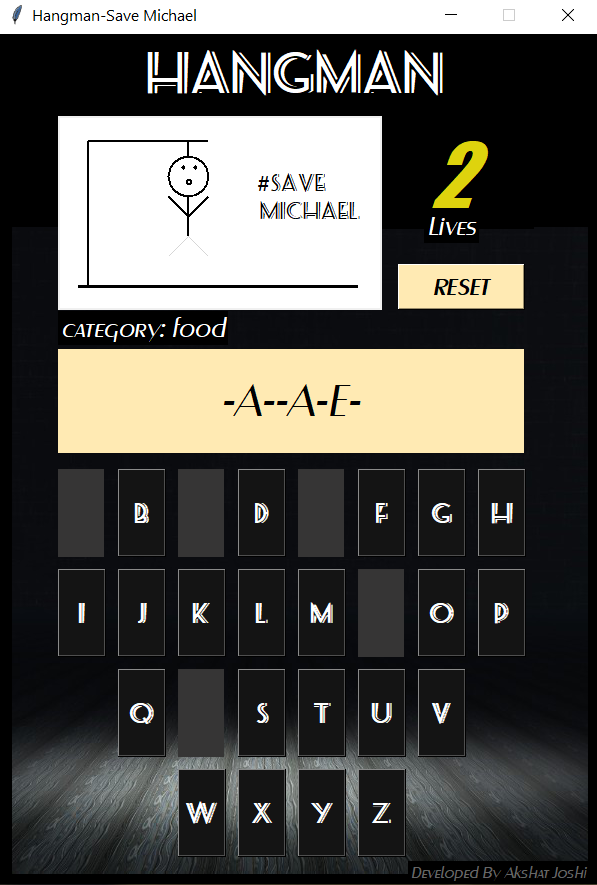
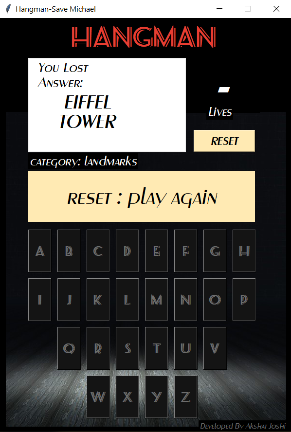
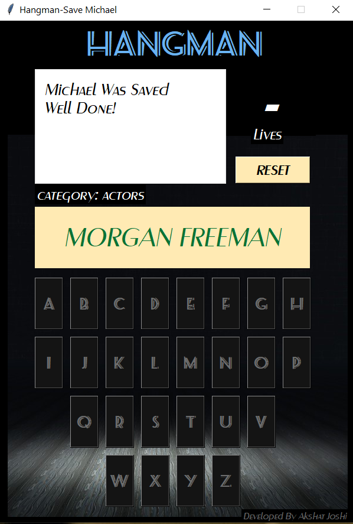

# Hangman
 One of the most popular trivia games. Created using Python 2.3 & Tkinter with a simple yet intuitive design.

 &nbsp; &nbsp; 
  
 &nbsp; &nbsp; 

Note: Please install the required fonts in your system if you wish to download & run.
